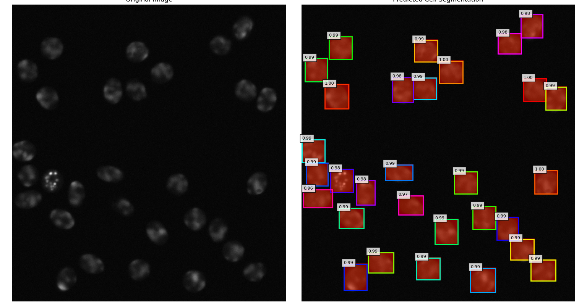

# 🔬 CellFlow: Deep Learning-based Cell Tracking and Analysis 🧬

## Table of Contents
* [1. Project Overview](#1-project-overview)
* [2. Problem Statement & Motivation](#2-problem-statement--motivation)
* [3. Dataset](#3-dataset)
* [4. Methodology: A Two-Phase Pipeline](#4-methodology-a-two-phase-pipeline)
  * [4.1 Phase 1: Instance Segmentation with Mask R-CNN](#41-phase-1-instance-segmentation-with-mask-r-cnn)
  * [4.2 Phase 2: Post-Processing & Temporal Analysis](#42-phase-2-post-processing--temporal-analysis)
    * [4.2.1 Cell Tracking Algorithm](#421-cell-tracking-algorithm)
    * [4.2.2 Behavioral Analysis](#422-behavioral-analysis)
* [5. Results & Discussion](#5-results--discussion)
* [6. Challenges & Solutions](#6-challenges--solutions)
* [7. Key Learnings](#7-key-learnings)
* [8. Future Work & Extensions](#8-future-work--extensions)
* [9. Technical Stack](#9-technical-stack)

---

## 1. Project Overview
This project, **CellFlow**, presents an end-to-end pipeline for **automated cell segmentation, tracking, and behavioral analysis** from time-lapse fluorescent microscopy images. It leverages a fine-tuned Mask R-CNN model to perform instance segmentation on every frame, followed by a custom post-processing algorithm to track individual cells and quantify their behavior. The pipeline culminates in a powerful dual-panel visualization that tells the story of a single cell's journey.

---

## 2. Problem Statement & Motivation
In cell biology and drug discovery, understanding the dynamic behavior of cells (e.g., migration, division, morphology) is critical. Manual tracking of individual cells in time-lapse videos is a tedious, time-consuming, and often imprecise task. The goal of this project is to automate this process, providing a robust, repeatable, and quantitative tool for biological and medical research.

---

## 3. Dataset
The project uses the **Fluo-N2DH-SIM+** dataset from the **ISBI Cell Tracking Challenge**.

* **Characteristics:** The dataset consists of 2D multi-channel time-lapse sequences of HeLa cells captured with high-resolution microscopy. It provides ground truth for both instance segmentation (`man_seg.tif`) and tracking (`man_track.tif`), which are essential for model training and evaluation.

* **Data Preparation:** The training data was consolidated from a multi-folder structure into single `images/` and `masks/` folders. Images were preprocessed with resizing and normalization, and the multi-labeled ground truth masks were programmatically converted into a format suitable for Mask R-CNN (a list of individual masks and bounding boxes per image).

---

## 4. Methodology: A Two-Phase Pipeline

### 4.1 Phase 1: Instance Segmentation with Mask R-CNN
This phase focuses on identifying and segmenting each individual cell in every frame.

* **Model Architecture:** A **Mask R-CNN** model with a pre-trained ResNet-50 backbone (pre-trained on the COCO dataset) was fine-tuned for the task. The final classification and segmentation heads were adapted for a two-class problem (`cell` and `background`).

* **Fine-Tuning:** The model was fine-tuned using a two-stage process:

  1. The backbone was frozen, and the new final layers were trained for a few epochs.

  2. The entire model was then unfrozen and trained for the remaining epochs with a very low learning rate to gently adapt the pre-trained weights.

* **Loss & Metrics:** Mean Average Precision (mAP) was used to evaluate performance, providing a comprehensive score for the accuracy of both bounding boxes and segmentation masks.

**Visual: A single frame with predicted masks and bounding boxes**

---

### 4.2 Phase 2: Post-Processing & Temporal Analysis
This is the core of the project, where the segmentation outputs are linked together to understand cell behavior.

#### 4.2.1 Cell Tracking Algorithm
* **Objective:** To assign a consistent unique ID to each cell across the entire time-lapse sequence.

* **Method:** A custom **centroid-based nearest-neighbor tracker** was implemented. The algorithm:

  1. Calculates the centroid of each segmented cell in consecutive frames.

  2. Matches cells from `Frame N` to `Frame N+1` based on the shortest Euclidean distance between their centroids.

  3. Uses a `max_distance_threshold` to prevent incorrect matches.

  4. Assigns a consistent `cell_id` for matched cells and a new ID for unmatched cells.

* **Output:** A `trajectories` dictionary mapping each `cell_id` to its chronological path of movement.

#### 4.2.2 Behavioral Analysis
* **Objective:** To derive meaningful, quantitative metrics from the tracking data.

* **Method:** A custom function analyzes the `trajectories` dictionary to calculate key behavioral metrics for each cell, including:

  * **Average Migration Speed:** The average distance a cell moves per frame.

  * **Total Path Length:** The total distance traveled along the cell's trajectory.

  * **Total Displacement:** The straight-line distance from the cell's start to end point.

---

## 5. Results & Discussion
The final project successfully demonstrates an end-to-end pipeline for cell tracking. The model achieved a high validation mAP of **0.9291**, indicating highly accurate segmentation. The tracking algorithm and subsequent analysis provide a quantitative understanding of cell behavior.

**Visual: Final dual-panel visualization showing the original video and the tracked path of a single cell**

---

## 6. Challenges & Solutions
* **Computational Constraints:** Solved by leveraging transfer learning with a pre-trained model and optimizing the training with a larger batch size on a powerful GPU.

* **Data Preprocessing:** Addressed the complex task of converting multi-labeled ground truth masks into the list of individual masks and bounding boxes required by Mask R-CNN.

* **Tracking Algorithm:** Designed a robust nearest-neighbor tracker with a distance threshold to handle cell movement and correctly assign unique IDs.

* **Visualization Clarity:** Developed a dual-panel visualization strategy to present complex data in a clear and uncluttered manner.

---

## 7. Key Learnings
This project provided invaluable experience in:

* Advanced deep learning for **instance segmentation** with Mask R-CNN.

* The fundamentals of **transfer learning and fine-tuning**.

* **Temporal data processing** and **motion tracking algorithms**.

* **Quantitative analysis** of image data to extract meaningful metrics (e.g., speed, displacement, length).

* **Debugging complex, multi-stage pipelines** in a real-world context.

---

## 8. Future Work & Extensions
* **Cell Division Detection:** Enhance the tracking algorithm to explicitly detect cell division events and track cell lineages.

* **3D Tracking:** Adapt the pipeline for 3D volumetric data from confocal microscopy.

* **Model Optimization:** Experiment with different backbones or model architectures to improve performance and speed.

---

## 9. Technical Stack
* **Languages:** Python 3.x

* **Deep Learning Frameworks:** PyTorch

* **Computer Vision & Image Processing:** OpenCV, Matplotlib

* **Data & Utilities:** NumPy, Scipy, `tqdm`, `imageio`, `torchvision`, `torchmetrics`

* **Tools:** Git, VS Code

---